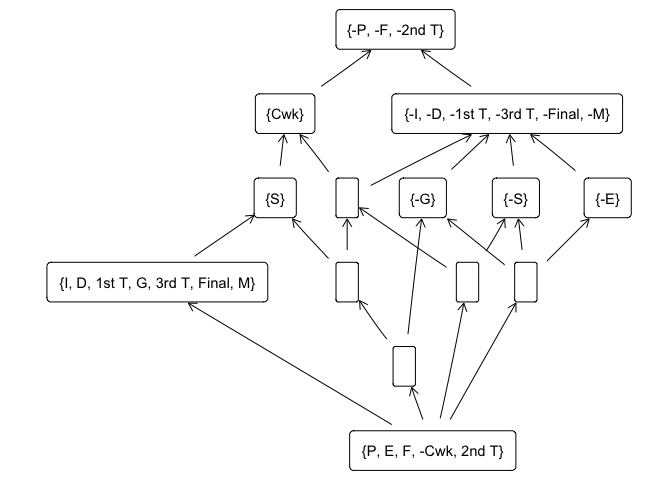

<!-- README.md is generated from README.Rmd. Please edit that file -->

# Introduction

This repository accompanies the paper of the same title as a means to
reproduce the results given in the paper.

We provide the code, data in the folders and the script
`Analysis_Script.Rmd` which, once executed, provides the HTML document
`Analysis_Script.html`.

Below, we copy the code and results to facilitate checking the results.
All the analyses can be reproduced using the commands below in a folder
with `code` and `data` subfolders, which store the functions and the
dataset and results used in the paper.

# Loading data

First, we must load some `R` libraries:

``` r
# Load libraries
library(tidyverse)
library(here)
library(Matrix)
library(fcaR)
```

Now, the core of the code is the `fcaR` package, but there are some
extensions (for example, to compute the minimal generators) that are, at
this moment, outside the package, and are included in the `code` folder.
We must load them.

``` r
# Load functions from "code" folder
code_folder <- here("code")
list.files(path = code_folder,
           pattern = "*.R",
           full.names = TRUE) %>% 
  sapply(source) %>% 
  invisible()  # To keep output clean
```

The data used in this paper is included in the `data` folder, so we must
load it (it is a formal context named `context3.rds`):

``` r
# Import data from data folder
data_folder <- normalizePath(here("data"))
fc <- FormalContext$new(file.path(data_folder, "context3.rds"))
```

# Formal Concept Analysis operations

We use the functions from the `fcaR` package to compute both the concept
lattice and the basis of implications of the mixed context.

``` r
# Find concept lattice and implications
fc$find_implications()
# Number of implications in the basis
fc$implications$cardinality()
#> [1] 403
# Number of concepts in the lattice
fc$concepts$size()
#> [1] 1769
```

# First Analysis: Concept lattice to explore the Knowledge Space

First, we build the sublattice formed by the concepts containing the
attributes `-P` and `-F` (we use the notation `-X` to denote the
negation of attribute `X`).

``` r
# Concepts and sublattice of those concepts containing -P and -F
selected_attributes <- c("-P", "-F")
id_attr <- which(fc$attributes %in% selected_attributes)
which_attr <- colSums(fc$concepts$intents()[id_attr, ]) == length(selected_attributes)
# Creation of the sublattice
sublattice <- fc$concepts$sublattice(which_attr)
sublattice$plot()
```

<!-- -->

# Second Analysis: Minimal generators

The computation of the minimal generators is very computationally
demanding (and may take hours to days, depending on the hardware), so we
include the code but we provide the precomputed minimal generators in
form of implication set.

This code would compute the minimal generators.

``` r
# Minimal Generators
lsi <- mingen0_minimals(
  attributes = fc$attributes,
  LHS = fc$implications$get_LHS_matrix(),
  RHS = fc$implications$get_RHS_matrix())
```

This code would create the implication set from the minimal generators.

``` r
imps <- lsi$to_implications(context = fc$I)
```

Actually, we load the precomputed system of implications.

``` r
imps <- readRDS(file = file.path(data_folder, "mingen_implications.RDS"))
```

From these implications, we select those that have `-Final` in the
right-hand side:

``` r
fail <- imps$filter(rhs = c("-Final"))
```

We only keep some of the implications, those whose support is above the
10%. That is, implications applicable to, at least, 10% of the students
in the course. In addition, we remove some redundancies that appear.

``` r
fail <- fail[fail$support() > 0.1]

# This gives us 41 implications
fail$cardinality()
#> [1] 41

# We use simplification logic to remove redundancies:
fail$apply_rules("simp")
#> Processing batch
#> --> Simplification: from 41 to 20 in 0.04 secs.
#> Batch took 0.043 secs.
```

The resulting set of implications is:

``` r
fail
#> Implication set with 20 implications.
#> Rule 1: {-2nd T, -3rd T} -> {-Final, -M}
#> Rule 2: {-F, -2nd T, -M} -> {-3rd T, -Final}
#> Rule 3: {-F, -2nd T, -G} -> {-3rd T, -Final, -M}
#> Rule 4: {-1st T, -3rd T, -M} -> {-2nd T, -Final}
#> Rule 5: {-1st T, -F} -> {-I, -D, -P, -2nd T, -3rd T, -Final, -M}
#> Rule 6: {D, -2nd T, -M} -> {-Final}
#> Rule 7: {-P, -2nd T, -3rd T} -> {-1st T}
#> Rule 8: {-D, -2nd T, -3rd T} -> {-1st T}
#> Rule 9: {-I, -D, -P, -2nd T, -3rd T} -> {-F}
#> Rule 10: {-P, -F, -3rd T} -> {-I, -D, -1st T, -2nd T, -Final, -M}
#> Rule 11: {-D, -F, -3rd T} -> {-I, -P, -1st T, -2nd T, -Final, -M}
#> Rule 12: {-D, -F, -2nd T, -M} -> {-I, -P, -1st T}
#> Rule 13: {-I, -D, -P, -3rd T, -M} -> {-F}
#> Rule 14: {-P, -3rd T, -M} -> {-1st T, -2nd T, -Final}
#> Rule 15: {-P, -F, -M} -> {-I, -D, -1st T, -2nd T, -3rd T, -Final}
#> Rule 16: {-I, -P, -F} -> {-D, -1st T, -2nd T, -3rd T, -Final, -M}
#> Rule 17: {-D, -P, -F} -> {-I, -1st T, -2nd T, -3rd T, -Final, -M}
#> Rule 18: {-I, -F, -2nd T} -> {-D, -P, -1st T, -3rd T, -Final, -M}
#> Rule 19: {-I, -2nd T, -G} -> {-Final, -M}
#> Rule 20: {-I, -D, -F, -M} -> {-P, -1st T, -2nd T, -3rd T, -Final}
```
